# Flashcards

Free spaced-repetition flashcards for Windows and Mac. It studies like Anki, looks like Quizlet, and
you write cards the way you write in Notion: type `/` for code, math, images and more.

Make your own decks, or bring them from Anki: download any deck from
[AnkiWeb's shared decks](https://ankiweb.net/shared/decks) (or export your own from Anki) and import
the `.apkg`.

**[Download the latest version](https://github.com/Tong-Minh/Flashcards/releases/latest)**
(Windows `-setup.exe`, Mac `.dmg`)

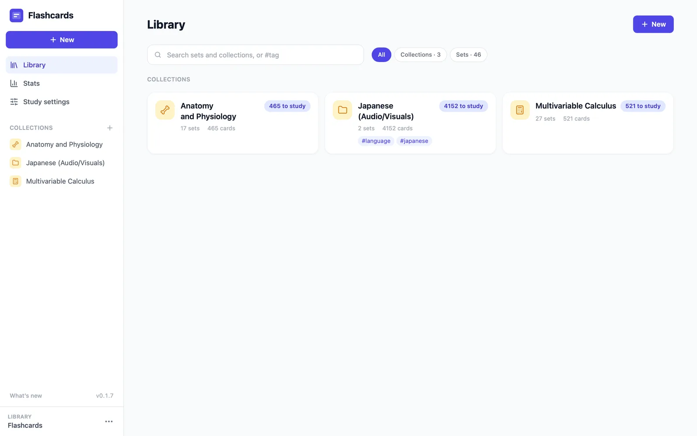

## What it does

### Studies like Anki

FSRS spaced repetition decides what comes up and when. Rate each card Again, Hard, Good or Easy and see
when it will come back. Study settings let you set your target retention (per set too, say 95% before an
exam) and fit the scheduler to your own history with Anki's optimizer. A Stats page shows a forecast, a
study calendar, true retention, answer buttons, and interval, stability and difficulty charts.
**View** mode flips through a whole set without affecting your schedule.

| Question | Answer |
|---|---|
| 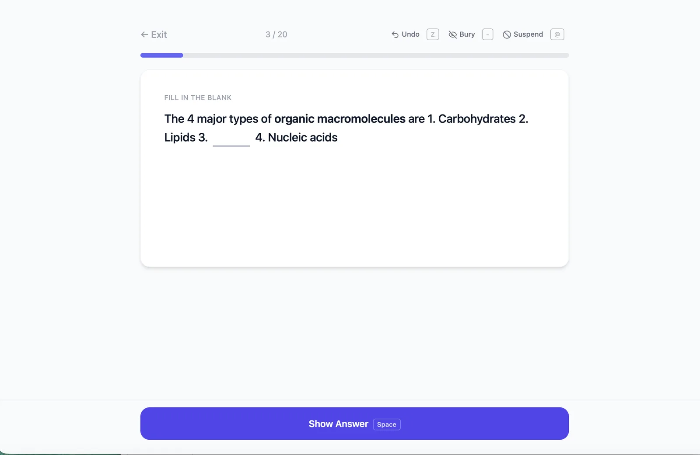 | 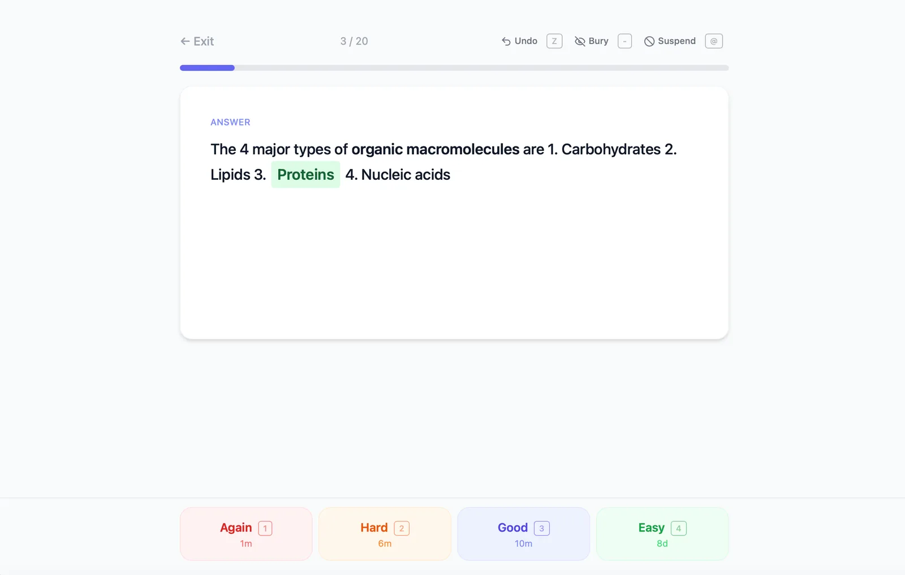 |

### Never touch the mouse

Everything works from the keyboard, so studying is just your hands on the keys:

| Key | While studying |
|---|---|
| Space / Enter | Show the answer, then flip between the sides |
| 1 2 3 4 | Again, Hard, Good, Easy |
| A–D (or 1–n) | Pick a multiple-choice option |
| T / F | Answer true or false |
| Z (or Ctrl/⌘+Z) | Undo the last rating |
| - / @ | Bury the card until tomorrow / suspend it |
| R | Replay the card's audio |
| ← → | Previous / next card in View mode |

Everywhere else, press **`** (the key above Tab) to open a numbered menu of what you can do on that page,
then a number to do it. On a set that's add a card, import, study, view, export, select, settings, stats
and search; the home page and collections have their own. The numbers never change, so 3 starts
studying a set and 1 adds a card, without looking.

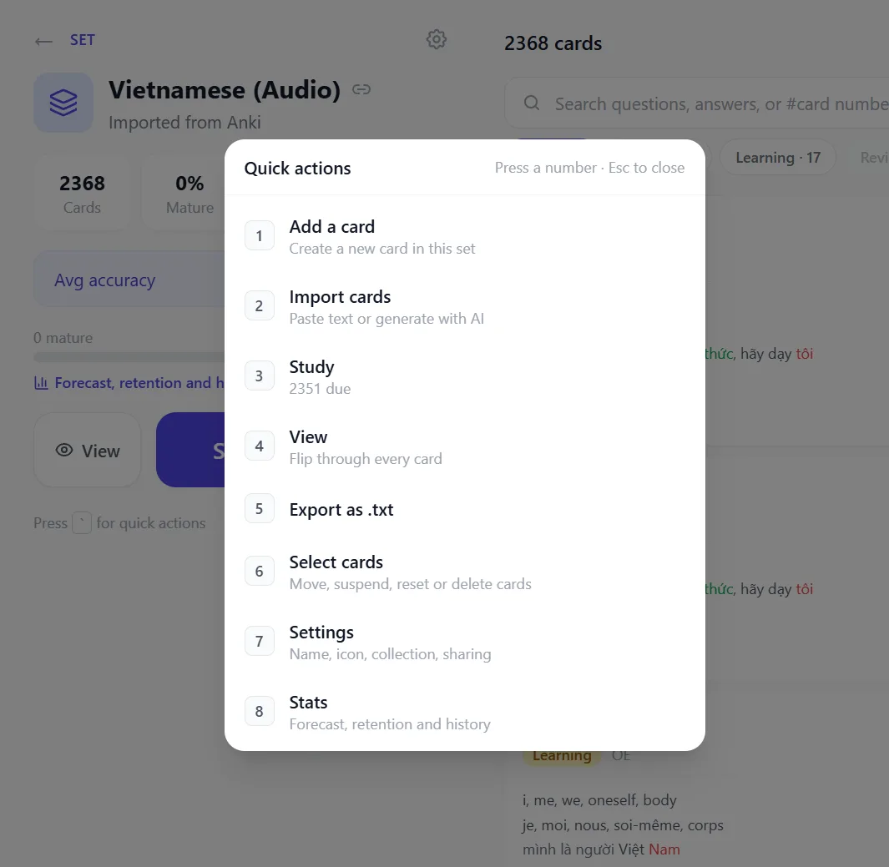

### Looks like Quizlet

A set shows every card with its formatting and pictures, with search (matches are highlighted),
progress, and a Study button with what's due. Collections group sets, and tags and search find them.

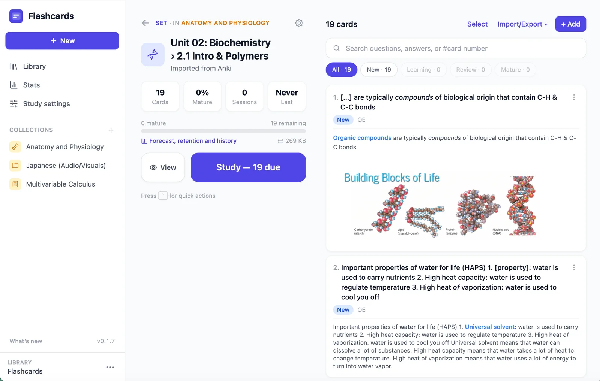

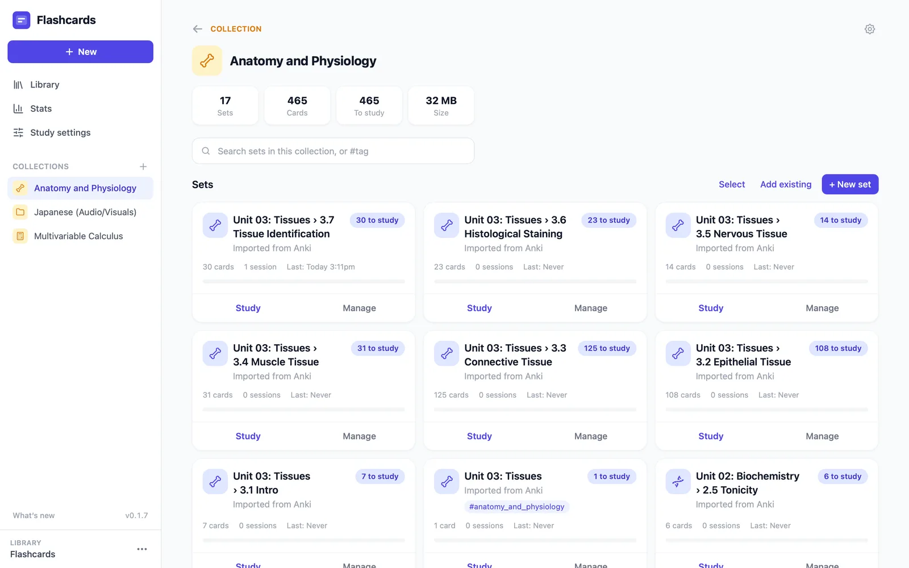

### Edits like Notion

Cards are written in a rich editor, and you never see raw markup. Type `/` anywhere for the menu:

- **Code blocks** with syntax highlighting for about 20 languages (Python, JavaScript/TypeScript, Java, C/C++,
  C#, Go, Rust, SQL, HTML…), and `inline code` within a sentence
- **Math** in LaTeX, rendered with KaTeX: inline in a sentence, or a centered block on its own line
- **Images** and **audio clips** (desktop app): pick a file, paste, or drag one in
- **Headings** (three sizes), **bulleted** and **numbered lists**
- **Bold**, *italic*, and **colored text** (red, green, blue, yellow, orange, purple), plus Clear formatting

Markdown-style shortcuts work as you type, too: `**bold**`, `*italic*`, `` `code` ``, `# ` for a
heading, `- ` or `1. ` for a list, and `$x^2$` for math. Ctrl/⌘+B and Ctrl/⌘+I also work, and Tab moves
to the next field.

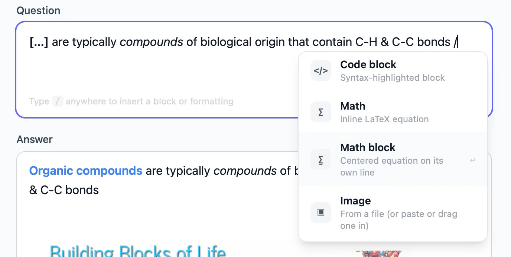

### Seven kinds of card

| Type | How you answer |
|---|---|
| **Open-ended** | Think of the answer, flip, and rate yourself. Can also be studied back to front. |
| **Type the answer** | Type it and get checked. Case, accents, extra spaces, a leading "the/a", and small typos are forgiven; numbers must match exactly. You can list extra accepted answers. |
| **Multiple choice** | Pick from the options (A–D on the keyboard). |
| **True / false** | T or F. |
| **Fill in the blank** | The answer is hidden in the sentence and revealed in place. |
| **Matching** | Pair up terms and definitions on a board. |
| **Image occlusion** (desktop app) | Drag boxes over a picture's labels and number them; each number becomes its own card. Hide all boxes and guess one, or hide just one. |

The auto-checks are only hints: what goes into your schedule is always the rating you choose.

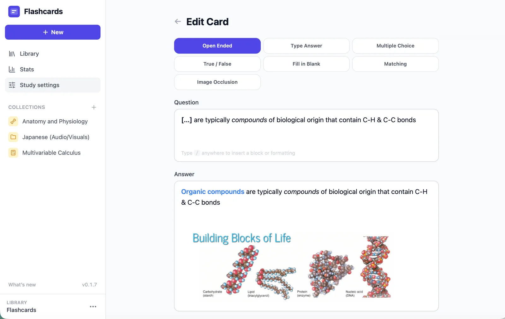

### Bring your Anki decks

**+ New → Import from Anki** takes an `.apkg` (or Anki's text export). Subdecks become sets inside a
collection, clozes become fill-in-the-blank cards, and math, code, formatting, images and audio come
along. Every card starts as new.

| | |
|---|---|
| 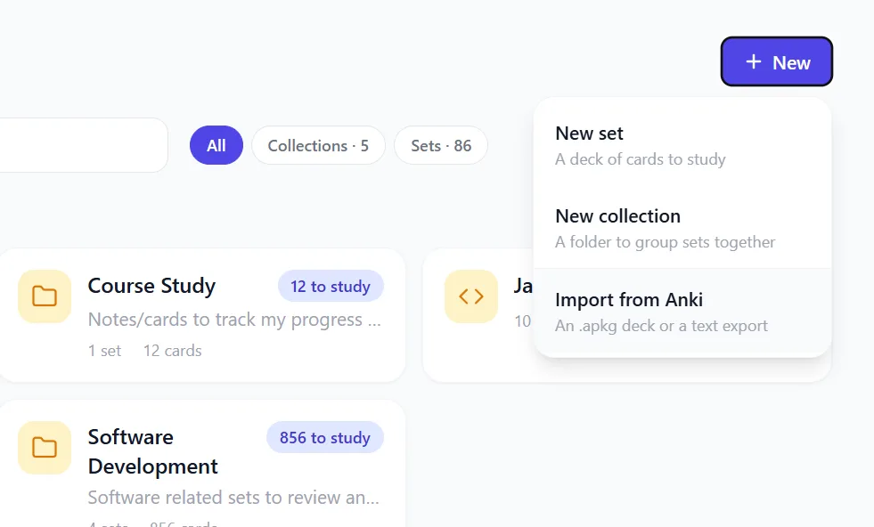 | 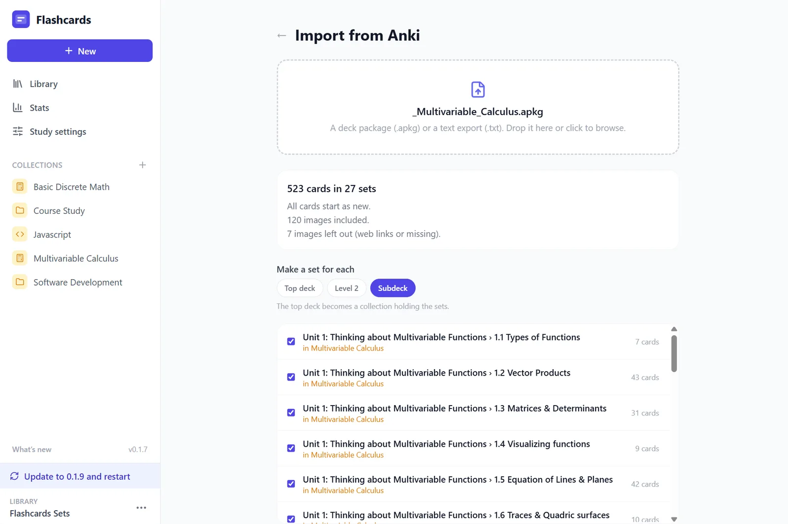 |

### Your cards are your files

The desktop app has no account. Everything lives in a folder you choose (put it in OneDrive or Dropbox
for backups), works offline, and has no limit on set size. It updates itself from GitHub Releases.

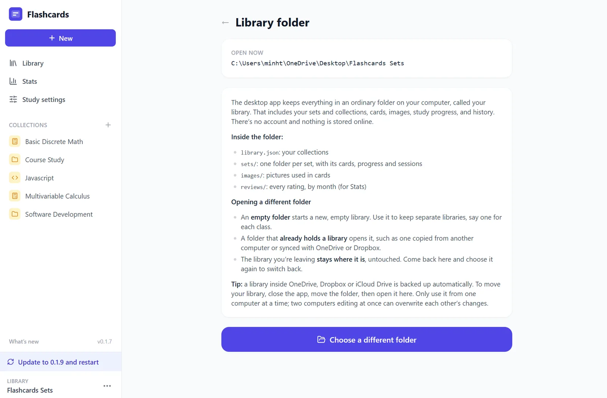

## The web version

There is also a web version (sign in with Google, sync across devices, install it on your phone, plus
friends, Discover and share links). It's private: just for me and my friends, and new accounts need an
invite password. Anyone can use the desktop app.

## Getting the desktop app

Download `Flashcards_x.y.z_x64-setup.exe` from the
[latest release](https://github.com/Tong-Minh/Flashcards/releases/latest) and run it. Windows may
say "Windows protected your PC": choose **More info → Run anyway** (the installer isn't code-signed).

On a Mac, download `Flashcards_x.y.z_universal.dmg`, open it, and drag Flashcards into Applications.
The app isn't notarized by Apple, so the first time you open it macOS blocks it: go to
**System Settings → Privacy & Security** and click **Open Anyway**. Updates install normally after that.

On first launch, choose a folder for your library. Putting it inside OneDrive or Dropbox gets you
automatic backups. To move sets between the web version, Windows and Mac, use **Export library** in
one app's ⋯ menu, then **Import library** in the other's.

## Library folder layout

```
library.json              collections
sets/<id>/set.json        the set
sets/<id>/cards.json      its cards
sets/<id>/progress.json   study progress per card
sets/<id>/sessions.json   completed study sessions
```

The files are plain JSON, so you can read them, back them up, or edit them by hand.

## Development

Requirements: Node 20+. The web app also needs a Supabase project (`.env.local` with
`NEXT_PUBLIC_SUPABASE_URL` and `NEXT_PUBLIC_SUPABASE_PUBLISHABLE_KEY`).

| Command | What it does |
|---|---|
| `npm run dev` | Web app at http://localhost:3000 |
| `npm run build` | Web production build (also the type check) |
| `npm run dev:desktop` | Desktop version in the browser, with a browser-storage library (no login) |
| `npm run build:desktop` | Desktop static export to `out/` |
| `npm run desktop:dev` / `desktop:build` | The real desktop app (needs [Rust](https://rustup.rs) and the MSVC build tools) |

Without Rust installed, GitHub Actions builds the desktop app: pushing a branch other than `main`
runs a test build (the installer is attached to the run), and pushing a `v*` tag publishes a release.

### Releasing a desktop update

```
npm version patch        # bumps package.json and creates the tag
git push --follow-tags
```

Also bump `version` in `src-tauri/Cargo.toml` to match. The release workflow signs the update with
the `TAURI_SIGNING_PRIVATE_KEY` repository secret. Keep a backup of that key: installed apps only
accept updates signed with it.

See [CLAUDE.md](CLAUDE.md) for the architecture.
